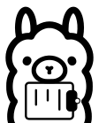

<div align="center">
  
</div>

# C3L - Clipllama

Make your clipboard interact with an Ollama server.

Simply use **Copy** in any application and automatically attach it to your prompt!
Since the clipboard is so broadly available, you can chain and integrate this tool with you favourite command line applications, TUIs, GUIs and whatever you can imagine.

## Features

- Send a prompt to Ollama and automatically attach the clipboard content
- (Optionally) Update clipboard content with Ollama response
- (Optionally) Print to `stdout`
- Enable/Disable **thinking** mode of supported models like **qwen3**

## Installation

### Homebrew

To install the `c3l` package via Homebrew, run the following command:

```bash
brew install github.com/FalconTube/c3l

# Or in verbose form
brew tap FalconTube/c3l
brew install c3l
```

or

This will install the latest version of `c3l` from the Falcontube/c3l repository, adding the binary to your system's PATH.

### Golang

```bash
go install github.com/FalconTube/c3l@latest
```

This will install the latest version of `c3l` on your system and put the `c3l` binary on your path.

### Binary install

You can also download the binaries from the [GitHub releases page](https://github.com/FalconTube/c3l/releases) for all platforms.

## Usage

The main command is `c3l do`, which takes the given `<prompt>` and the clipboard content
and sends it to Ollama. Aliases are `exec,ask,run`.

```bash
$ c3l --help

Takes the clipboard content + given prompt and sends it to Ollama. If no subcommand is given, executes the 'do' command.

Examples:

    $ c3l "let's talk about the clipboard content" -p
    $ c3l do "let's talk about the clipboard content" -p
    $ c3l config list
    $ c3l prompts add "let" "let's talk about the clipboard content"

Commands:
  do (exec,ask,run)    Send <prompt> and clipboard content to Ollama
  config               Interact with default config at $HOME/.c3l.toml
  prompts              Interact with prompts
  systems              Interact with system prompts

Flags:
  -h, --help       Show context-sensitive help.
      --version    Show version
      --debug      Enable debug info

Run "c3l <command> --help" for more information on a command.

```

All flags can be permanently set in a config file at `$HOME/.c3l.toml`.
`c3l` has a `config` command to both initialize and list the content of this file.

````bash

$ c3l --help
Usage: c3l <command>

Takes the clipboard content + given prompt and sends it to Ollama

Flags:
  -h, --help    Show context-sensitive help.

Commands:
  do (exec,ask,run) <prompt> [flags]
    Send <prompt> and clipboard content to Ollama

  config init [flags]
    Create default config at $HOME/.c3l.toml

  config list
    List contents of config

Run "c3l <command> --help" for more information on a command.```
````

## User Defined Prompts

You can save (long) prompts for easy, repeated use in `c3l`.

To do so, simply add your custom commands and abbreviations in the `[prompts]` section of the `$HOME/.c3l.toml` config file as such:

```toml
other flags
...

[prompts]
example = "Using the '--expand' flag with the word 'example' as the prompt will expand into this string."
```

Then use the `--expand` flag and pass your abbreviation (in this case `example`) to the cli e.g.:

```bash
c3l do "example" --expand
# Will turn into
# c3l do "Using the '--expand' flag with the word 'example' as the prompt will expand into this string."
```
